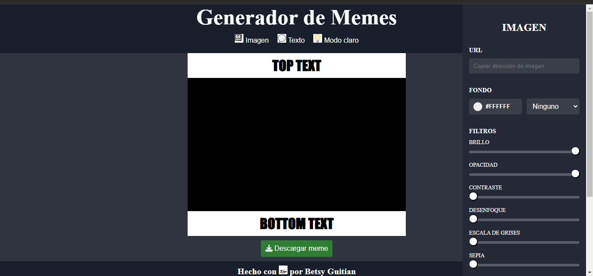
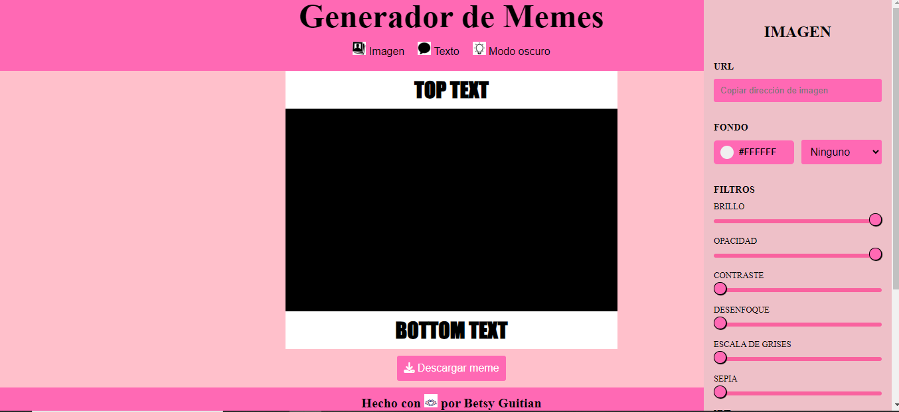

# **Editor de Memes**
***
## _Descripción_
Este es mi trabajo final del modulo 2 de la carrera Desarrollo Front-end, en el aplique los conocimientos y herramientas aprendidos en este modulo para así
diseñar una app para editar y crear memes.
***
## _Funciones de la app_
Para editar o crear un meme: 
 Cargar una url de cualquier imagen que desees (**LAS IMAGENES CON DERECHO DE AUTOR NO DESCARGAN**).
* Podes a la imagen cambiarle el fondo de color.
* Tenes la opción de cambiar los filtros de la imagen (Brillo, Opacidad, Contraste, Saturado, Negativo, entre otros.)
* Hay dos Textos disponibles, **Superior e Inferior**. 
* Podes cambiar el estilo de la letras, color, tamaño, fondo o ponerlo transparente.
* Quitar los textos o alguno de ellos.

## _Para ver más_
Este el link de la app 
<a href="darling-crumble-fbeced.netlify.app/" target="_blank">Click Aquí</a>
***
Así se ve en Modo Oscuro para desktop, ya que la app es responsiva y adaptativa para diferentes dispositivos.

Así se ve en Modo Claro

***
## _Contacto_
Acá mis Redes Sociales, si queres contactarme:
* <a href="http://wa.me/541134277653">Whatsapp</a>
* <a href="http://github.com/betsynohe">Github</a>
* <a href="http://www.linkedin.com/in/betsy-guitian-b36b06242/">Linkedin</a>
* <a href="mailto:betsyguitian@gmail.com">E-mail</a>
